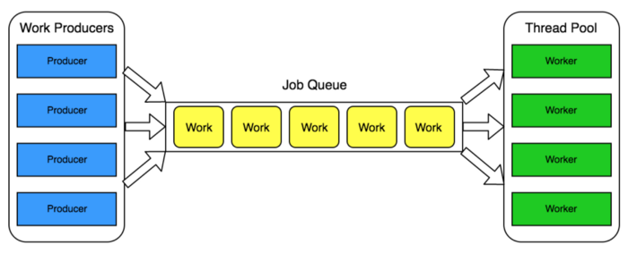

### Building A Multi-Threaded Web Server In Rust

To solidify my understanding of Rust, I built this multithreaded web server from *The Rust Programming Language* by Steve Klabnik and Carol Nichols.

### Motivation
I am super excited about the Rust programming language because it feels like a revolution.

From a tech standpoint, the safety it brings to systems programming represents a paradigm shift.    

From a social standpoint, the Rust community's open source philosophy provides an essential push towards a tech industry by and for all people.

---

### Process

Details to be added.

---
### Technologies & Code Snippets

- std::io::prelude
- std::net::TcpStream
- std::net::TcpListener
- std::fs
- std::thread
- std::time::Duration